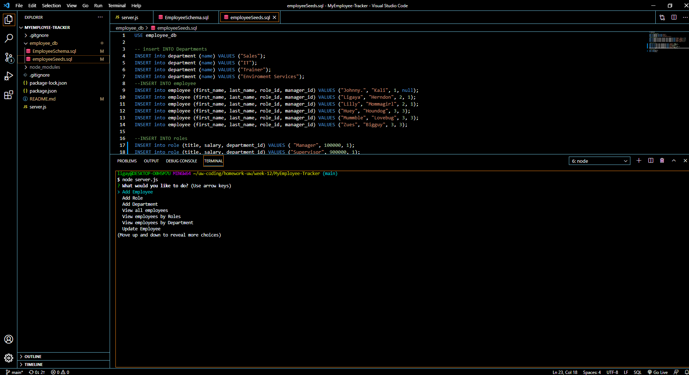

# MyEmployee-Tracker
An Command Line Application that will help a user keep track of their employees. The Rooster will incldue the Employee First Name, Last Name, Salary, Department and Job title. The application will be able to allow the user to create, update, add, delete. 

# Installation Process
Express
Mysql
Node

# Author
Ligaya Herndon 

ligaya96@gmail.com

# Screen shot

# Walkthough
 <a href="https://drive.google.com/file/d/11Vzri5Taink4VsbfjNllQPUqOAWE-rIp/view">Demo!</a> 

